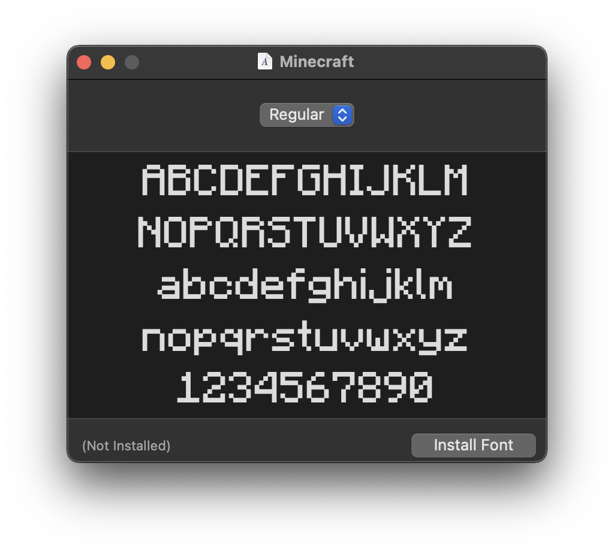
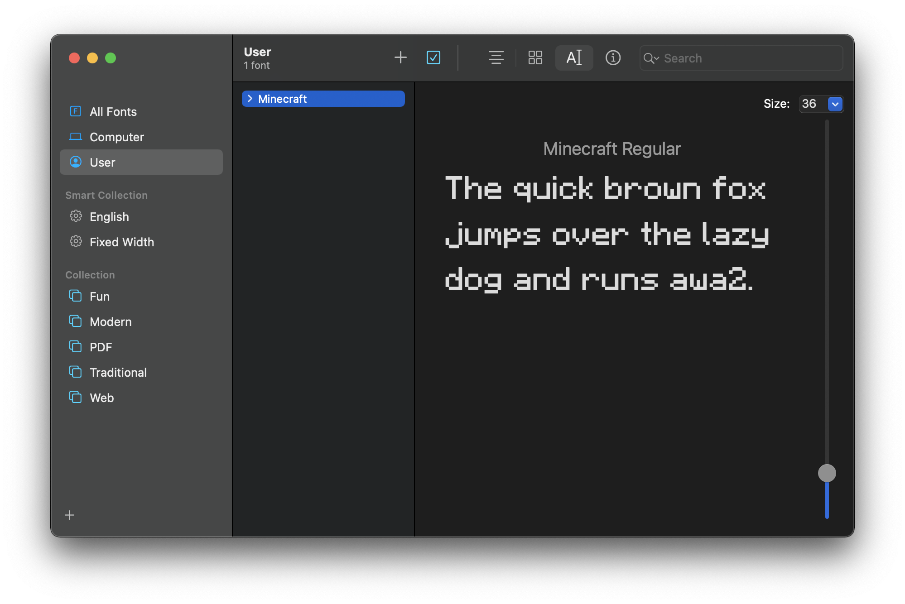

# Minecraft Font

## 1. Disclaimer

Minecraft is a video game created and maintained by Mojang Studios of Microsoft, while Minecraft Font is the regular font intergrated in the game of which I have no copyright.

I drew this font set copying exactly what they look like in the game out of the love to the game, and partially because I didn't find a font the same as is in Minecraft after a long search late at night.

## 2. Usage

The font covers all ASCII characters. (95 as total, including space)

To install the font on macOS, just download `Minecraft-Regular.ttf` and double-click it or choose to open it with Font Book.

To install the font on Windows, simply drag `Minecraft-Regular.ttf` file and put it into the system font folder.

`ascii_mc.glyphs` is the original editable file that you can open with the font maker *Glyphs*.

